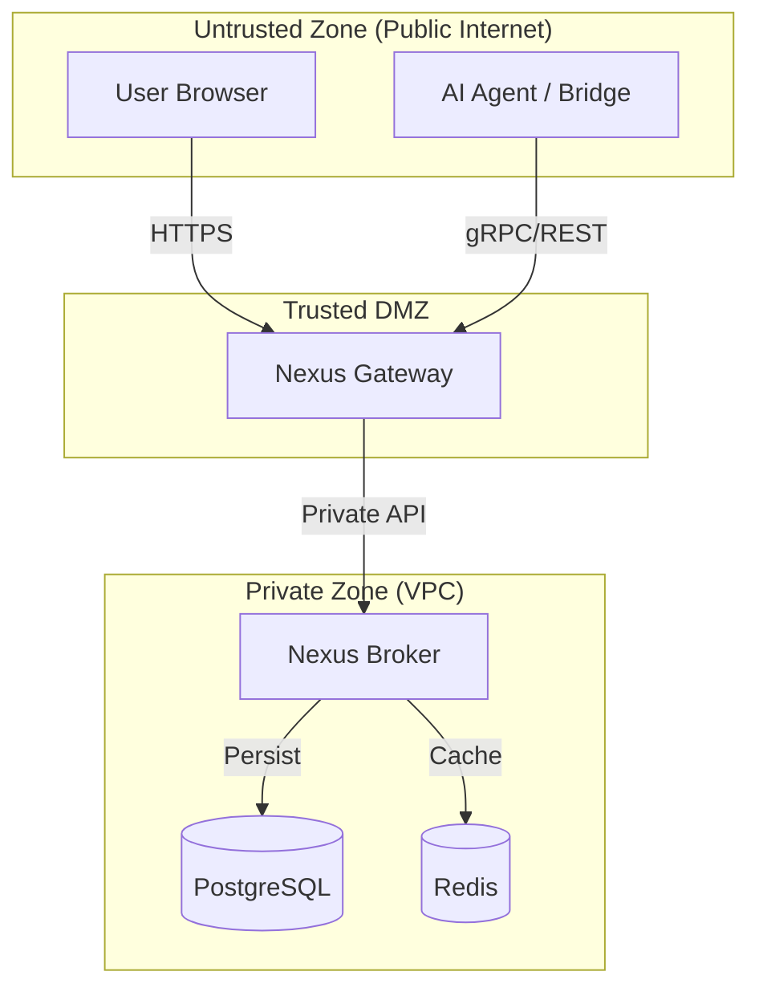

# Nexus Framework Architecture

The Nexus Framework operates on a **split-plane architecture**. It decouples the management of identity (Control Plane) from the consumption of identity (Data Plane).

This separation ensures that your AI agents—which may run untrusted code or operate in insecure environments—never hold the "keys to the kingdom" (Master Secrets).

---

## 1. System Topology

### Zone Definitions

1.  **Untrusted Zone:** Where your users and agents live. Traffic is potentially malicious.
2.  **Trusted DMZ:** The entry point for all external traffic. Contains the **Gateway**, which performs authentication, throttling, and request validation.
3.  **Private Zone:** The secure core. Contains the **Broker** and databases. No public ingress is allowed here (except for specific callback whitelists).

---

## 2. Component Deep Dive

### A. Nexus Broker (The Vault)
The Broker is the central authority and the only stateful service in the framework.

- **Role:** System of Record for all connections and secrets.
- **Responsibilities:**
    - **Encryption:** Encrypts all Refresh Tokens and API Keys at rest using AES-256-GCM.
    - **Key Management:** Holds the Master `ENCRYPTION_KEY`.
    - **Orchestration:** Manages the complexity of OAuth 2.0 (PKCE, State signing) and OIDC Discovery.
    - **Life Support:** Runs a background loop to refresh expiring tokens proactively.
- **Security Context:** Critical. If the Broker is compromised, all connections are at risk. It must be isolated.

### B. Nexus Gateway (The Proxy)
The Gateway is a stateless "thick proxy" that abstracts the complexity of the Broker from the outside world.

- **Role:** Public Interface (API).
- **Responsibilities:**
    - **Protocol Translation:** Translates external HTTP/REST requests into internal gRPC calls to the Broker.
    - **Identity Masking:** Ensures agents refer to connections by opaque UUIDs (`connection_id`), masking internal database IDs.
    - **Authentication:** Validates incoming requests before they reach the critical Broker infrastructure.
- **Security Context:** High. It is the shield for the Broker.

### C. Nexus Bridge (The Connector)
The Bridge is a Go library (SDK) that runs *inside* your agent's process.

- **Role:** Smart Client.
- **Responsibilities:**
    - **Strategy Execution:** It downloads "Authentication Strategies" from the Gateway (e.g., "Put this token in header X") and executes them. It is "dumb" about the provider logic but "smart" about execution.
    - **Resilience:** Implements exponential backoff, jitter, and automatic reconnection for WebSockets/gRPC.
    - **Observability:** Emits structured logs and metrics about connection health.
- **Security Context:** Low. It only holds short-lived "Usage Secrets" (Access Tokens). If an agent is hacked, the blast radius is minimal.

---

## 3. Data Flows

### Flow 1: Connection Creation (The Handshake)

This flow links a user's identity (e.g., Google Account) to a Nexus `connection_id`.

1.  **Initiation:** The Agent calls `POST /v1/request-connection` on the Gateway.
2.  **State Generation:** The Gateway asks the Broker to generate a secure authorization URL. The Broker signs a cryptographic `state` parameter using the `STATE_KEY`.
3.  **Redirect:** The Agent redirects the User's browser to the returned `authUrl`.
4.  **Consent:** The User logs in at the Provider (Google) and grants permission.
5.  **Callback:** The Provider redirects the User back to the Broker's `/auth/callback` endpoint.
6.  **Exchange & Encrypt:**
    - The Broker verifies the `state` signature (preventing CSRF).
    - It exchanges the Authorization Code for an Access Token and Refresh Token.
    - It encrypts these tokens and stores them in PostgreSQL.
7.  **Finalize:** The Broker redirects the User back to the Agent's application with `status=success`.

### Flow 2: Usage (The Signing Loop)

This flow occurs whenever an agent needs to call an external API.

1.  **Request:** The Bridge (inside the Agent) calls `GET /v1/token/{connection_id}` on the Gateway.
2.  **Proxy:** The Gateway validates the request and forwards it to the Broker using its internal `BROKER_API_KEY`.
3.  **Decryption:**
    - The Broker retrieves the encrypted record from the DB.
    - It decrypts the Master Secret (Refresh Token).
    - **Check:** If the Access Token is expired, the Broker performs a synchronous refresh with the Provider.
4.  **Response:** The Broker returns *only* the short-lived Access Token (Usage Secret) and the Signing Strategy to the Gateway, which forwards it to the Bridge.
5.  **Execution:** The Bridge modifies the Agent's outgoing HTTP request (injecting headers) and sends it to the Provider.

---

## 4. Data Model

### Provider Profile (`provider_profiles`)
Defines the "Shape" of an integration.
- `name`: "google", "github"
- `auth_type`: "oauth2", "api_key"
- `scopes`: Default permissions to request.
- `endpoints`: Auth URL, Token URL, API Base URL.

### Connection (`connections`)
Represents a link between a User and a Provider.
- `id`: The public UUID handle.
- `status`: `active`, `pending`, `failed`, `attention`.
- `provider_id`: FK to the profile.

### Token (`tokens`)
Stores the actual secrets.
- `encrypted_data`: AES-GCM encrypted blob containing Access Token, Refresh Token, and metadata.
- `expires_at`: Timestamp for the Access Token (used for proactive refresh).
